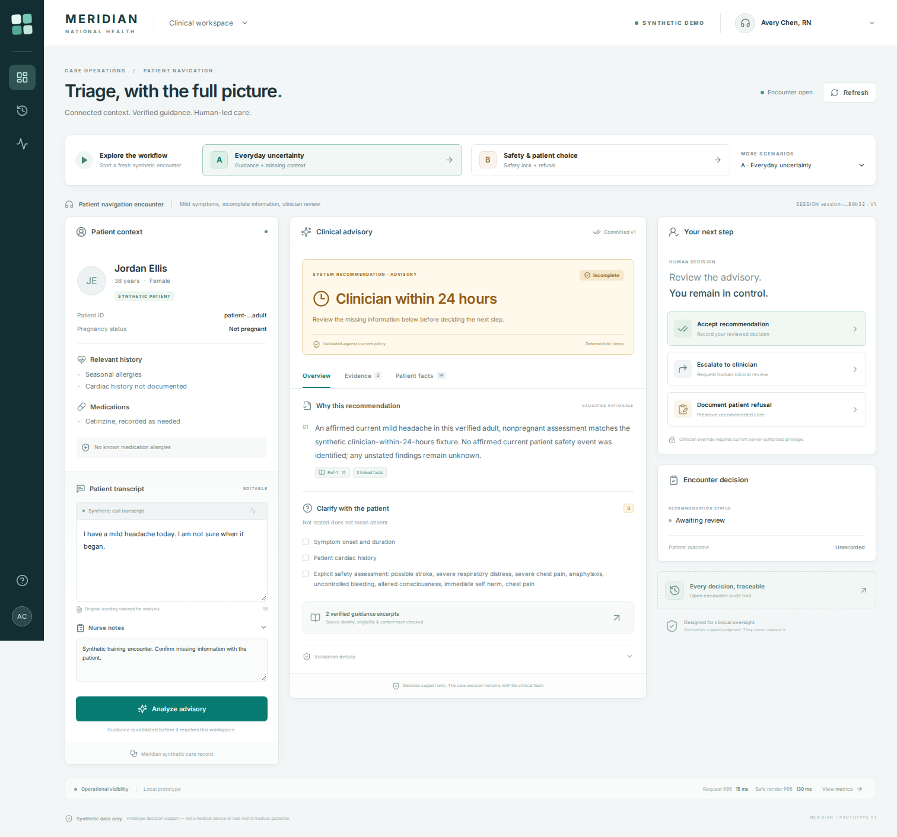

# Meridian Patient Navigation & Triage Copilot

A runnable nurse-facing demonstration of grounded advisory triage, human decision
recording and fail-closed safety controls. Python/FastAPI + Pydantic v2 + bounded
LangGraph + SQLite; Next.js/React/TypeScript; local deterministic vector retrieval.

**Synthetic data only. Not a medical device. Not real-world medical guidance.**
The curated symptom patterns, guideline excerpts and policy rules are invented
training fixtures. Do not enter real patient data or use this application for care.



## Start locally

Requirements: Python 3.11+ (tested on 3.12), Node.js 22+ (tested on 24), npm and
two terminals. No LLM account, API key, cloud vector database or external service
is needed for the default demo.

From the extracted `meridian` directory:

```bash
python3 -m venv .venv
.venv/bin/python -m pip install -r requirements.lock
npm --prefix frontend ci
```

Terminal 1, from the repository root:

```bash
.venv/bin/python -m uvicorn backend.app:app --host 127.0.0.1 --port 8000
```

Terminal 2, from the repository root:

```bash
npm --prefix frontend run dev -- --hostname 127.0.0.1 --port 3000
```

Open [http://localhost:3000](http://localhost:3000). API documentation is at
[http://127.0.0.1:8000/docs](http://127.0.0.1:8000/docs). The Next.js server forwards
`/api` requests to the local backend. Stop either process with Ctrl+C. SQLite
session state persists at `var/meridian.sqlite3` by default. A backend restart
rotates the default ephemeral signing key; reload/sign in again after a restart.

`make setup`, `make backend` and `make frontend` are equivalent conveniences.

## Two-minute demo

| Time | Action | What to show |
|---|---|---|
| 0:00–0:15 | Select **Demo A** with the default nurse identity | Synthetic patient context, history and editable transcript appear before synthesis. |
| 0:15–0:40 | Select **Analyze advisory** | Only the committed, validated advisory appears. Show missing facts, structured rationale and turn-local source labels. The incomplete routine fixture proposes clinician review, never home monitoring. |
| 0:40–0:55 | Accept with a brief rationale; open the audit view | A separate nurse action persists, linked to the immutable system recommendation and audit provenance. |
| 0:55–1:15 | Select **Demo B**, then analyze | The synthetic current chest-pain rule yields **EMERGENCY_DEPARTMENT**, with a prominent safety lock. |
| 1:15–1:40 | Document patient refusal, entering rationale and preference | The system still recommends ED. Declined care and the patient remaining home are separate warning states. The recommendation does not become green. |
| 1:40–2:00 | Choose the provider-timeout fixture, then analyze | “AI synthesis unavailable — manual clinical review required.” Verified context and evidence remain available; the nurse can escalate. |

The scenario selector also includes explicit negation, historical symptoms,
family history, unsupported populations, empty evidence, source injection,
tampering, malformed output, invented citations/facts and provider 429 cases.
The complete low-acuity fixture is a positive control for the strict home gate.
The standard nurse has no override permission. The clinician and delegated nurse
are distinct synthetic server identities for authorization demonstrations.

## Tests and reproducible rehearsal

Delivered verification: **153 backend tests and 23 frontend tests passed**, with
contract checks, production build, and live API/browser rehearsals passing.

```bash
.venv/bin/python -m pytest
npm --prefix frontend test
npm --prefix frontend run typecheck
.venv/bin/python scripts/export_openapi.py --check
npm --prefix frontend run generate:check
npm --prefix frontend run build
```

With the backend running, rehearse the live HTTP API:

```bash
.venv/bin/python scripts/rehearse.py --output artifacts/api-rehearsal.json
```

The rehearsal verifies normal acceptance, committed-response replay, ED refusal
without recommendation mutation, provider failure with retained evidence, and
audit visibility. It exits nonzero on any failed assertion. See
`docs/verification.md` for the results from the delivered build and
`docs/test-matrix.md` for release-blocker coverage.

To launch both servers, run all live API and browser paths, and then stop them:

```bash
npm --prefix frontend exec -- playwright install chromium
.venv/bin/python scripts/run_rehearsal.py --browser
```

To rehearse the production build, run `npm --prefix frontend run build` first,
then `.venv/bin/python scripts/run_rehearsal.py --browser --production`.
Screenshots are written to `docs/screenshots/`; summarized results go to
`docs/api-rehearsal.json` and `docs/browser-rehearsal.json`.

## Contract authority

Only `backend/domain/contracts.py` defines API models. FastAPI emits
`contracts/openapi.json`, and openapi-typescript generates
`frontend/generated/api.ts`. Components consume generated schema aliases.

After an intentional contract change:

```bash
.venv/bin/python scripts/export_openapi.py
npm --prefix frontend run generate
```

Update consumers and tests together. Drift checks must stay green. See
`contracts/CONTRACT.md` for version and idempotency semantics.

## Optional provider mode

Default deterministic mode runs entirely locally and uses the same output schema,
fact/evidence binding and policy validator as the provider adapter. Provider mode
is opt-in and requires an environment key:

```bash
export MERIDIAN_PROVIDER_MODE=openai
export MERIDIAN_PROVIDER_MODEL=gpt-4.1
export MERIDIAN_PROVIDER_API_KEY='YOUR_OWN_KEY'
.venv/bin/python -m uvicorn backend.app:app --host 127.0.0.1 --port 8000
```

Keep keys out of source control. Credentials and network access were not required
for the delivered demo. The live provider path is subject to model availability,
latency and provider errors. Failure enters manual mode; there is no automatic
fallback to a weaker model or unchecked generated recommendation.

## Security and data boundaries

- Every object read/write checks server identity, tenant and resource relationship.
  Demo login intentionally lets you select a synthetic identity; it is not
  production authentication and the app should be bound to loopback for demos.
- Revocable override authority is checked freshly at execution. UI permissions
  and stale tokens cannot authorize a sensitive write.
- Discovery records are untrusted. A separate registry verifies identity,
  approval, population, dates and content hashes before issuing citation aliases.
- Model rationale must exactly match a current-turn server claim catalog. Merely
  citing an existing fact ID is insufficient to authorize an invented assertion.
- Responses publish only after a successful durable compare-and-swap commit.
  Out-of-order and conflicting equal-version responses are blocked by the client.
- Operational audit contains identifiers/hashes/decision metadata, not raw
  transcripts or model prompts. Restricted diagnostics are separate and disabled
  by default. No external telemetry service is configured by this application.
- Nurse acceptance does not imply patient consent. A later human action cannot
  erase a recorded refusal. Only a new explicit patient response could establish
  a changed preference; that additional consent workflow is outside this demo.

## Performance

`GET /api/metrics` reports per-stage P50/P95/P99, 429/deadline/manual-mode rates
and submitted time-to-safe-render measurements. The 3–4 second P95 is a
**prototype target**, not a guarantee. Local deterministic measurements do not
predict hosted-model performance. Tests never relax thresholds to hide a failure.

## Known limitations

- Exact curated language and conservative context parsing do not constitute a
  general medical NLP system. Unrecognized/uncertain inputs require manual review.
- Numeric vital-sign interpretation is outside the fixture policy. Supplied vitals
  are retained as facts and require manual review; no clinical thresholds are invented.
- Adults and explicitly non-pregnant patients only; other/unknown applicability
  cannot receive automated low-acuity recommendations.
- Synthetic records, synthetic policy and local vector retrieval only. No EHR,
  real clinical protocol, live audio, production identity or care-team integration.
- SQLite, process-local operational metrics and local prototype authorization are
  designed for a local demonstration, not distributed production deployment.
- In-flight turn reservations survive in SQLite. After a process crash, an unknown
  in-flight turn stays blocked; use a new turn or encounter after human review.
  Distributed lease recovery is future hardening work.
- The optional live provider adapter must be qualified separately. Deterministic
  failure-injection tests demonstrate software controls, not clinical efficacy.
- Full production security, accessibility and usability certification, validated
  crash recovery and realistic load testing remain future work.

See `docs/hardening-roadmap.md` for clinical governance, OIDC/delegation services,
PostgreSQL/RLS, signed evidence, model qualification, privacy and operational work.
See `docs/architecture.md` and `docs/repository-tree.txt` for design and layout.
