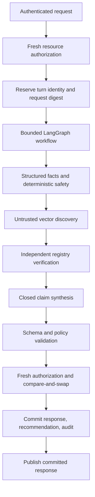

# Architecture and safety boundaries

This is a synthetic training prototype. Its fixtures are not clinical protocols,
and its recommendations must never be used to make real patient-care decisions.

## Request and commit path

Retrieval and synthesis execute outside database write transactions. Turn
reservations prevent duplicate workflow execution on network retries. A short
commit transaction compares the submitted base version with the current durable
session version. Losing results return a conflict and never become clinical UI
content. Crashed in-flight reservations require explicit session recovery/new
turn; a process cannot assume an unknown previous attempt completed safely.

## Independent trust boundaries

| Boundary | Trusted authority | Untrusted input |
|---|---|---|
| Identity | Validated server-issued demo token | Actor/tenant claims in request data |
| Write authority | Current server care assignment and delegation | Cached UI permissions or old token authority |
| Safety | Checked-in synthetic deterministic policy fixture | Free text, model disposition |
| Evidence | Independent registry identity, hash, dates, population | Vector record text and metadata |
| Claims | Turn-local closed fact and claim catalog | Model prose, references, suggested outcome |
| Publication | Durable compare-and-swap commit | Completed but stale computation |
| Rendering | Monotonic version and canonical content identity | Out-of-order or conflicting HTTP response |

## Why claim IDs are insufficient

A model could cite an existing unknown fact while claiming that it is absent.
The validator therefore binds the entire claim, its text, fact references and
evidence references to the exact server-constructed current-turn catalog. The
model can select validated claims; it has no authority to add clinical prose.
Unknown facts remain unknown and may produce clarification prompts. This
deliberately limits expressiveness in exchange for a testable prototype boundary.

## Human decisions remain separate

System recommendations are append-only and linked by supersession. Human action
records identify the original recommendation, actor, action, rationale and time.
Patient responses are separate records. Declining recommended ED care leaves the
ED recommendation and safety lock intact. A permitted clinician override records
a distinct human disposition without mutating the advisory recommendation.

## Operational versus diagnostic data

The normal audit trail records identifiers, hashes, authorization outcomes,
validation codes and action references. Raw transcripts and generated payloads do
not belong in operational logs. Restricted diagnostic traces are separate,
disabled by default and subject to short retention. The application database
necessarily contains synthetic patient/session information and must not be
confused with the minimal operational audit domain.

Immutable `turn_inputs` retain each committed synthetic input in the clinical
encounter store. They are separate from the PHI-minimal audit trail. The current
session transcript is updated atomically with its recommendation, so refreshing
the dashboard cannot pair an edited advisory with an older input.

Nurse acceptance does not create patient consent. Subsequent clinician actions
cannot erase an existing patient refusal of the same recommended care.

## Contract governance

The Pydantic v2 schemas in `backend/domain/contracts.py` are authoritative.
FastAPI exports OpenAPI; openapi-typescript generates the frontend schemas.
`make contracts` refreshes both artifacts; `make check-contracts` checks drift.
Changes must update the authority, generated outputs, consumers and tests together.

## Implementation references

- [FastAPI OpenAPI generation](https://fastapi.tiangolo.com/how-to/extending-openapi/)
- [LangGraph StateGraph](https://reference.langchain.com/python/langgraph/graph/state/StateGraph)

These references concern framework mechanics, not clinical policy. The local
fixtures are the only sources of demonstration escalation rules.
